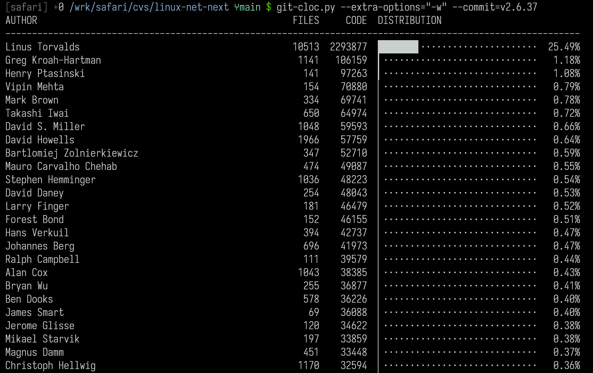

git-cloc
========

`git-cloc.py` Python script using parallel processing to generate accurate Git
code ownership statistics by combining git blame survivor lines with
[cloc](https://github.com/AlDanial/cloc)’s comment and whitespace filtering.

## Notes
`--since` parameter changes the semantic meaning (lines written before that date that
survived will be attributed to "unknown" or the previous author, or simply ignored).

## Screenshot

<!-- Links -->
[cloc]:
    <https://github.com/AlDanial/cloc>
    "cloc github"
